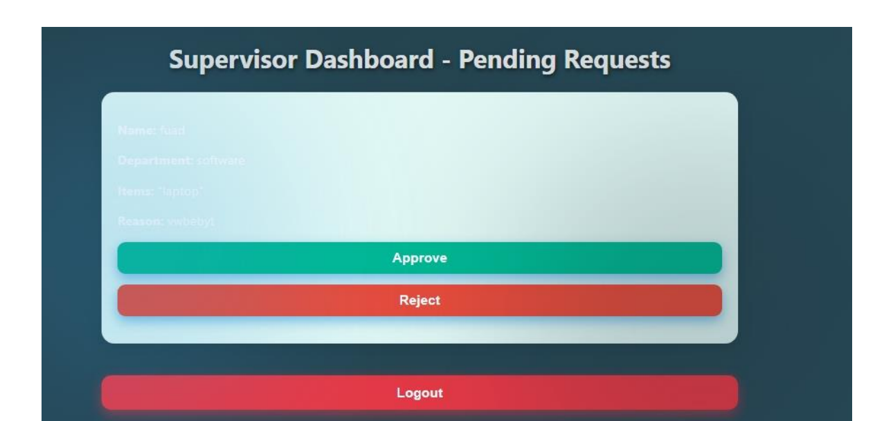
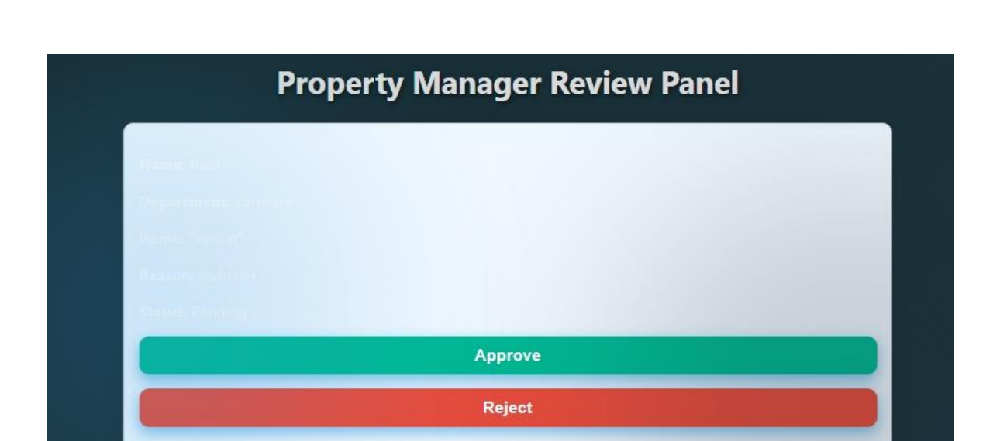
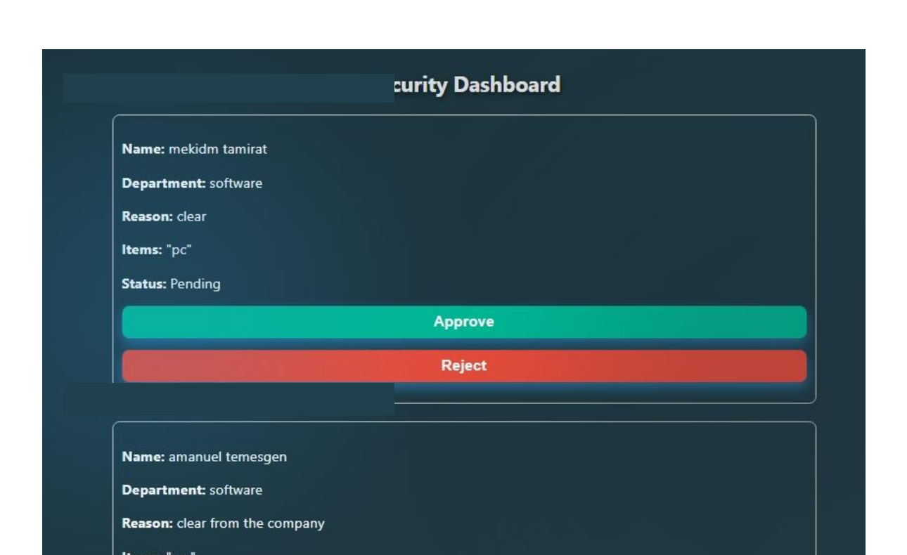
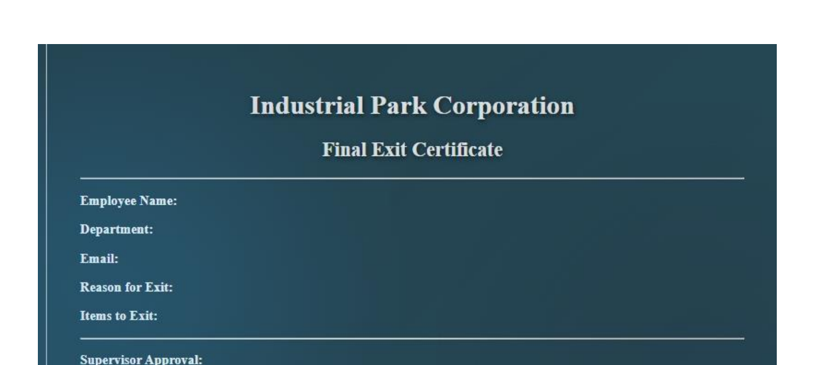

# 🏢 Property Exit Management System (PEMS)

## 📌 Overview

The **Property Exit Management System (PEMS)** is a full-stack web application developed during my Software Engineering internship at the **Industrial Park Development Corporation (IPDC), Ethiopia**.

The system digitizes the employee property clearance process by replacing paper-based workflows with an automated, secure, multi-stage approval system.

Employees can submit property exit requests, while Supervisors, Property Managers, and Security Officers review and approve requests through a structured workflow.

---

## 🎯 Problem

The traditional property clearance process relied heavily on paper-based procedures.

This created challenges such as:

- Manual request processing
- Difficult tracking of approval status
- Delays between departments
- Paper-based documentation
- Difficulty maintaining centralized records
- Manual generation of clearance certificates

PEMS was developed to digitize this process and improve efficiency, tracking, and documentation.

---

## 💡 Solution

PEMS provides a centralized web-based platform where employees can submit property exit requests and authorized personnel can process them through multiple approval stages.

The system provides:

- Secure authentication
- Role-based access control
- Employee dashboards
- Department-specific dashboards
- Multi-stage approval workflow
- Automated PDF certificate generation
- Email notification
- Centralized MySQL database

---

## 🚀 Key Features

### 👤 Employee

- Employee registration and login
- Secure authentication
- Employee dashboard
- Submit property exit requests
- Track request status
- Receive exit certificate

### 👨‍💼 Supervisor

- Review employee requests
- Approve or reject requests
- Monitor request status

### 🏢 Property Manager

- Review approved requests
- Verify property clearance
- Approve or reject requests

### 🔐 Security Officer

- Perform final security verification
- Approve or reject requests
- Complete the clearance process

### 📄 Automated Documents

- Generate property exit certificates
- Generate PDF documents using PDFKit

### 📧 Email Notification

- Send generated certificates to employees
- Email integration using Nodemailer

---

## 🔄 System Workflow

```text
Employee
   │
   ▼
Submit Property Exit Request
   │
   ▼
Supervisor Approval
   │
   ▼
Property Manager Verification
   │
   ▼
Security Verification
   │
   ▼
Generate PDF Exit Certificate
   │
   ▼
Email Certificate to Employee

┌─────────────────────────┐
│       Frontend          │
│ Next.js / React / CSS   │
└────────────┬────────────┘
             │
             ▼
┌─────────────────────────┐
│       Backend           │
│ Node.js / API Routes    │
│ Authentication / RBAC   │
└────────────┬────────────┘
             │
             ▼
┌─────────────────────────┐
│        Database         │
│          MySQL          │
└─────────────────────────┘
pems-project/
│
├── app/
│   └── api/
│
├── data/
│
├── fonts/
│
├── lib/
│
├── pages/
│
├── public/
│
├── styles/
│
├── .gitignore
│
└── README.md
🔐 Security

The system implements several security-related mechanisms, including:

JWT-based authentication
Password hashing using bcrypt.js
Role-Based Access Control (RBAC)
Protected application workflows
Role-specific dashboards
📄 PDF Certificate Generation

After the required approval stages are completed, the system generates a property exit certificate in PDF format.

The project uses PDFKit for PDF generation.

📧 Email Integration

The system uses Nodemailer to send generated exit certificates to employees through email.

## 🗄️ Database Design

### Entity-Relationship Diagram

The PEMS database consists of three key entities:

- **Users** — stores system users and their roles.
- **Requests** — stores employee property exit requests.
- **Approvals** — stores approval records associated with requests.

One user can create multiple requests, and each request can have multiple approval records linked to different roles. This relational structure supports data consistency and referential integrity.


## 📸 System Screenshots

### Supervisor Dashboard



### Property Manager Dashboard



### Security Dashboard



### Property Exit Certificate



📚 Learning Outcomes

Through this project, I gained practical experience in:

Full-Stack Web Development
REST API Development
Authentication and Authorization
Database Design
System Analysis and Design
Role-Based Access Control
Email Integration
PDF Generation
Software Testing
Software Documentation
🎓 Project Context

This project was developed during my Software Engineering internship at the Industrial Park Development Corporation (IPDC), Ethiopia.

It provided practical experience in developing a real-world software system and applying Software Engineering concepts to an organizational workflow.

👨‍💻 Author

Haftamu Teamr

Software Engineering Graduate
Woldia University, Ethiopia

📧 Email: habtamu.teamr@wldu.edu.et

🔗 GitHub: https://github.com/habtamuteam

🌐 Portfolio: https://my-portfolio-ashen-nine-5iphqrbq1h.vercel.app/

📜 License

This project was developed for academic and internship purposes.
